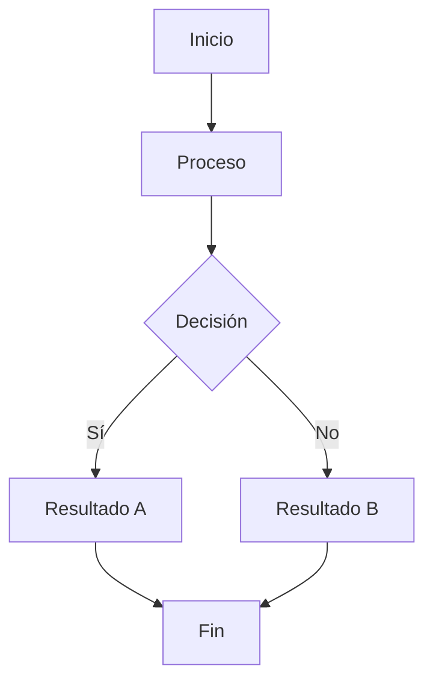

# Introducción

Bienvenido al libro de la tesis.

## Ejemplo de diagrama Mermaid

```mermaid
graph TD;
    A[Inicio] --> B[Proceso];
    B --> C{Decisión};
    C -->|Sí| D[Resultado A];
    C -->|No| E[Resultado B];
    D --> F[Fin];
    E --> F;
```
